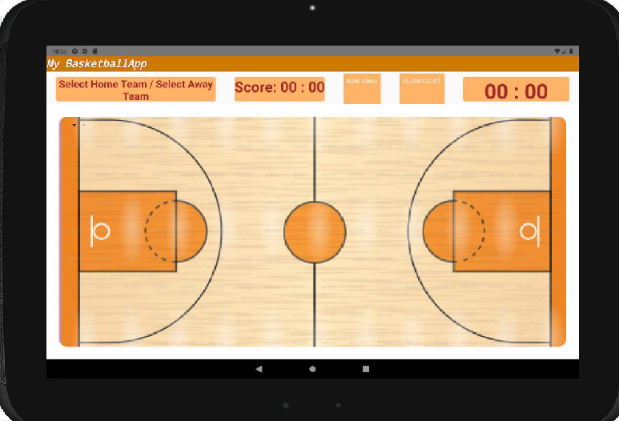
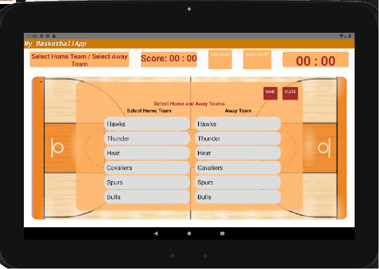
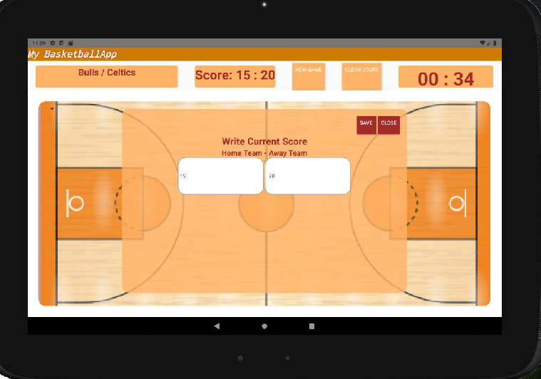
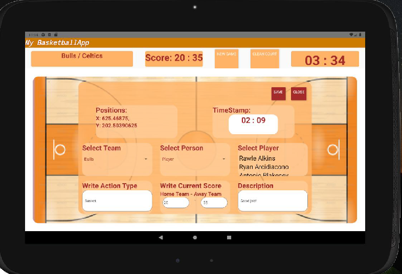

# Basketball-Stats

Nowadays, people enjoy spending time with various sports like football, basketball, volleyball, athletics, etc. Most of these people watch and follow these sports regularly, even if they do not do them themselves. For example, a real basketball lover likes to analyze important actions while watching basketball matches. Therefore, we have created an application that will help a basketball lover about this goal in this project. With this application, the user can record a action s/he finds important simultaneously while watching a basketball game and see the position of this action on the map.

This project consists of two main parts which are mobile application and the video editing part. In mobile application, user can save the important game actions while watching the game. Since we use React Native to develop so our application can be compatible for both Android and iOS environment. Our application has one interface to save the important match actions. In video editing part, at another time, user can see and follow these important actions s/he recorded in the application by giving a video of the match s/he watched to the system. User can see these actions with their descriptions in the video.

The user can access the following functionalities using our application.
- User can select home and away team
- User can enter teams’ scores
- User can see teams’ scores
- User can see the match time
- User can save the important actions with the position, team, action type, name of the player who did the action, time, scores and description.
- User can clean the court
- User can give the game video to the system and get edited video with saved actions with their information and descriptions.

## Screenshots from Application:
### First look of the Application

### Selection of the Home and Away Teams

### Score Changing

### Save the Action

### Court after Some Actions

